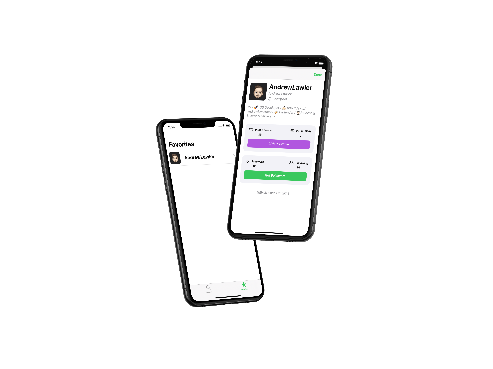

# GHFollowers
iOS App built during Sean Allen's iOS Take Home Project course. Really enjoyed this course and learned so much!

## What does the app do?
- Search for a GitHub accounts followers
- View each followers user information
- Save and store your favorite GitHub users locally

## What did the course cover?
- Custom Alerts
- Custom UI Elements
- Programmatic UI
- Child View Controllers
- Animations
- Networking and Persistence
- Swift features such as Result type and Variadic Parameters

## Where can I get the course?
https://seanallen.teachable.com
